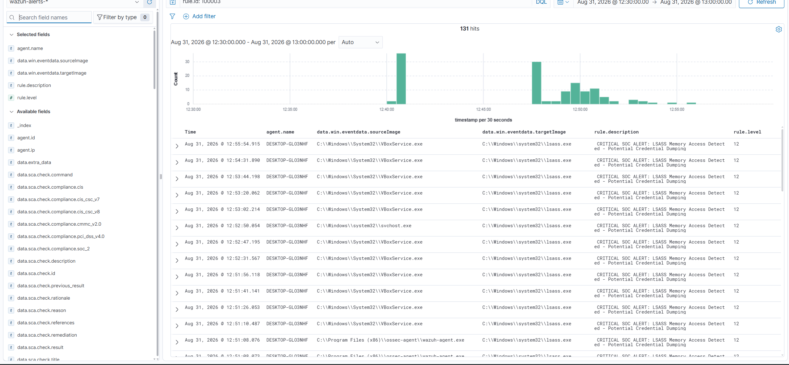
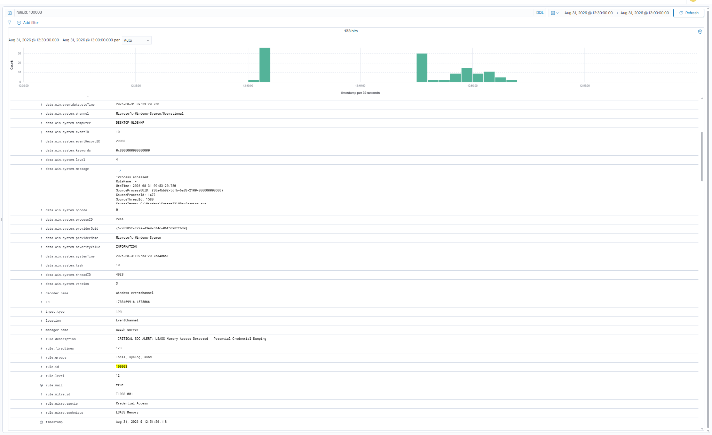
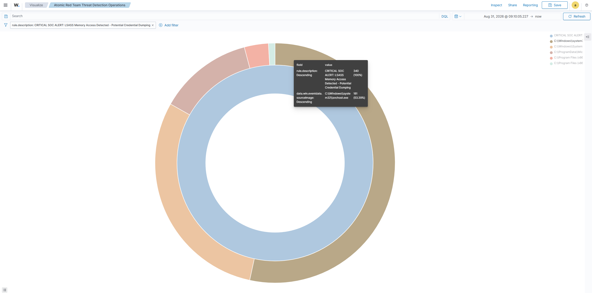

# Cyber Defense Lab: SIEM Deployment & Detection Engineering

## Quick Stats
- **SIEM:** Wazuh v4.x
- **Endpoint:** Windows 10 + Sysmon
- **Attack Techniques:** 2 (T1003.001 - ProcDump & comsvcs.dll)
- **Custom Rules:** 1 (Rule 100003 - Level 12 CRITICAL)
- **MITRE Mapping:** T1003.001 (Credential Dumping)

---

## Project Summary
Built an end-to-end security monitoring lab to simulate real-world cyber attacks and validate custom detection rules. Deployed Wazuh SIEM, configured Sysmon for deep endpoint telemetry, executed MITRE ATT&CK techniques using Atomic Red Team, and authored custom detection rules mapped to T1003.001 (Credential Dumping).

Engineered a live cyber defense environment capable of capturing endpoint telemetry, detecting credential access attempts, and escalating suspicious LSASS memory access activity in real time.

---

## Technical Environment

| Component              | Technology                               |
|------------------------|------------------------------------------|
| Virtualization         | Oracle VirtualBox                        |
| SIEM Platform          | Wazuh SIEM Manager (v4.x)                |
| Endpoint OS            | Windows 10                               |
| Telemetry Collector    | Sysmon                                   |
| Attack Simulation      | Atomic Red Team (`Invoke-AtomicRedTeam`) |
| Detection Engineering  | Sigma (YAML) + Wazuh XML                 |

---

## Key Activities & Achievements

### SIEM Deployment & Configuration
- Deployed Wazuh virtual appliance with **8GB RAM / 4 vCPUs**
- Configured **Bridged Networking** for endpoint communication
- Installed and registered Wazuh agent on Windows 10 victim machine
- Verified log ingestion over port **1514**

### Endpoint Telemetry (Sysmon)
- Installed Sysmon with SwiftOnSecurity configuration
- Created custom `sysmonconfig.xml` targeting **`C:\Windows\System32\lsass.exe`** process access
- Enabled **Event ID 10 (ProcessAccess)** for credential dumping detection
- Dynamically updated the running Sysmon driver without reboot using PowerShell:

```powershell
C:\Windows\Sysmon.exe -c C:\Windows\sysmonconfig.xml
```

- Tuned endpoint telemetry to ensure LSASS memory access attempts were captured by Sysmon

### Detection Engineering
- Authored a vendor-agnostic **Sigma rule (YAML)** for LSASS memory access detection
- Translated the detection logic into native **Wazuh XML Rule 100003**
- Deployed the custom rule inside:

```text
/var/ossec/etc/rules/local_rules.xml
```

- Configured **Level 12 (CRITICAL)** severity alerts
- Mapped detection logic directly to **MITRE ATT&CK T1003.001**
- Added a SOC-focused alert description identifying the source process responsible for LSASS access
- Configured the rule with `no_full_log` to control alert output

```xml
<rule id="100003" level="12">
  <if_group>sysmon</if_group>
  <field name="win.system.eventID">^10$</field>
  <field name="win.eventdata.targetImage">lsass.exe$</field>
  <description>CRITICAL SOC ALERT: LSASS Memory Access Detected - Potential Credential Dumping ($(win.eventdata.sourceImage))</description>
  <mitre>
    <id>T1003.001</id>
  </mitre>
  <options>no_full_log</options>
</rule>
```

### Attack Simulation & Validation
- Executed credential dumping simulations against LSASS memory using **Atomic Red Team**
- Used **ProcDump (Test 1)** and **comsvcs.dll / rundll32.exe (Test 2)** to simulate credential access activity
- Executed Atomic Red Team techniques mapped to **T1003.001**
- Used automated prerequisite installation to stage required Sysinternals binaries:

```powershell
Invoke-AtomicTest T1003.001 -GetPrereqs
```

- Executed the Atomic Red Team tests:

```powershell
Invoke-AtomicTest T1003.001 -TestNumbers 1
Invoke-AtomicTest T1003.001 -TestNumbers 2
```

- Discovered and troubleshot initial test failures caused by:
  - Default Sysmon telemetry suppression resulting in missing **Event ID 10**
  - Missing prerequisite binaries such as **`procdump.exe`**
- Tuned Sysmon configuration and staged missing prerequisites to restore complete attack telemetry
- Verified real-time telemetry capture for **`procdump64.exe`** and **`rundll32.exe`** targeting LSASS memory space
- Validated real-time **Level 12 CRITICAL** alerts on the Wazuh dashboard
- Built custom visualization for LSASS access monitoring

---

## Verification & Detection Evidence

### Active Alert Stream & Histogram
- Verified active alert aggregation and real-time detection hits for **custom Wazuh Rule 100003**
- Confirmed repeated LSASS access events were being detected and escalated as critical alerts

### Expanded Telemetry Payload
- Verified detailed Sysmon **ProcessAccess Event ID 10** telemetry
- Confirmed telemetry showing **`procdump64.exe`** accessing **`lsass.exe`**

### Structured Detection Data
- Verified structured event fields including:
  - Agent name
  - Source process (`procdump64.exe` / `rundll32.exe`)
  - Target process (`lsass.exe`)
  - Event ID (**10**)
  - Wazuh Rule ID (**100003**)
  - Alert severity (**Level 12**)

---


## Screenshots: Verification & Detection Evidence

| Alert Stream & Timeline (`4.png`) | Expanded Telemetry Payload (`3.png`) | Process Access Distribution (`5.png`) |
|-----------------------------------|--------------------------------------|---------------------------------------|
|  |  |  |

---
---

## Tools & Skills Demonstrated

- **SIEM:** Wazuh deployment, rule writing, dashboard creation
- **Endpoint Security:** Sysmon configuration and telemetry tuning
- **Threat Intelligence:** MITRE ATT&CK framework (T1003.001)
- **Adversary Emulation:** Atomic Red Team, `Invoke-AtomicRedTeam`
- **Detection Engineering:** Sigma (YAML), Wazuh XML
- **Virtualization:** Oracle VirtualBox
- **Operating Systems:** Windows 10, Linux (administration)
- **Incident Response:** Alert validation, forensic analysis
- **Security Monitoring:** Real-time endpoint telemetry collection and alert validation
- **Detection Validation:** Attack simulation, telemetry verification, and custom rule testing

---

## Conclusion & Impact
Successfully established a complete threat detection pipeline from endpoint telemetry collection to SIEM alert generation.

The laboratory demonstrates that custom Sysmon telemetry configuration combined with tailored Wazuh detection logic can reliably identify and escalate suspicious LSASS memory access associated with credential theft attempts in real time.

The project also demonstrates practical detection engineering skills through adversary emulation, troubleshooting telemetry gaps, MITRE ATT&CK mapping, Sigma rule development, Wazuh rule creation, and validation of detections against simulated attack activity.

---

**Skills:** SIEM, Wazuh, Sysmon, MITRE ATT&CK, Threat Detection, Incident Response, Windows Security, Log Analysis, Sigma, YAML, XML, Atomic Red Team, Adversary Emulation, VirtualBox, PowerShell, Linux Administration

